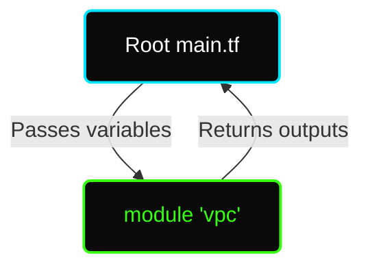

# ✦ Module: Terraform Modules

> **Reusable Infrastructure Code.** Don't Repeat Yourself (DRY). Modules allow you to package and reuse Terraform configurations across your organization.

---

## ✦ What is a Terraform Module?

A module is simply a collection of `.tf` files in a directory. 

Every Terraform configuration has at least one module, known as its **root module** (the directory where you run `terraform apply`). When you call another directory containing `.tf` files from your root module, that is a **child module**.

### Why use Modules?
1. **Reusability:** Write the code for an EC2 Auto Scaling Group once, and reuse it for 10 different microservices.
2. **Standardization:** Enforce company security policies (e.g., all S3 buckets must be encrypted) inside the module, so developers don't have to remember it.
3. **Blast Radius:** Break down massive monolith state files into smaller, isolated components.

---

## ✦ The Module Structure

A standard child module should look exactly like a root module:

```text
modules/
└── vpc/
    ├── main.tf        # Creates the VPC, Subnets, Route Tables
    ├── variables.tf   # Defines expected inputs (e.g., var.vpc_cidr)
    ├── outputs.tf     # Returns the created vpc_id, subnet_ids
    └── README.md      # Documentation on how to use the module
```

---

## ✦ Creating a Child Module

Let's say we have a `modules/vpc` directory.

**1. `modules/vpc/variables.tf` (The Inputs)**
```hcl
variable "cidr_block" {
  type        = string
  description = "The CIDR block for the VPC"
}

variable "environment_name" {
  type = string
}
```

**2. `modules/vpc/main.tf` (The Core Logic)**
```hcl
resource "aws_vpc" "main" {
  cidr_block = var.cidr_block

  tags = {
    Name        = "${var.environment_name}-vpc"
    Environment = var.environment_name
  }
}
```

**3. `modules/vpc/outputs.tf` (The Returns)**
```hcl
output "vpc_id" {
  value       = aws_vpc.main.id
  description = "The ID of the created VPC"
}
```

---

## ✦ Calling a Child Module

To use the module you just created, you call it from your root configuration using the `module` block.

```hcl
# This is in your root main.tf

module "production_vpc" {
  # The source argument is required!
  source = "./modules/vpc"

  # Pass values to the module's variables
  cidr_block       = "10.0.0.0/16"
  environment_name = "prod"
}

# You can access the module's outputs like this:
resource "aws_security_group" "web" {
  name   = "web-sg"
  # Referencing the output from the module
  vpc_id = module.production_vpc.vpc_id
}
```



---

## ✦ Module Sources

The `source` argument tells Terraform where to download the module from.

| Source Type | Example |
|---|---|
| **Local Path** | `source = "./modules/vpc"` |
| **Terraform Registry** | `source = "terraform-aws-modules/vpc/aws"` |
| **GitHub Repo** | `source = "github.com/hashicorp/example"` |
| **Generic Git** | `source = "git::https://example.com/vpc.git"` |
| **S3 Bucket** | `source = "s3::https://s3-eu-west-1.amazonaws.com/my-bucket/vpc.zip"` |

> [!TIP]
> **Use Versioning!** When using modules from the Terraform Registry or GitHub, always pin the version or Git tag to prevent upstream changes from breaking your infrastructure.
> ```hcl
> module "vpc" {
>   source  = "terraform-aws-modules/vpc/aws"
>   version = "5.1.0"
> }
> ```
