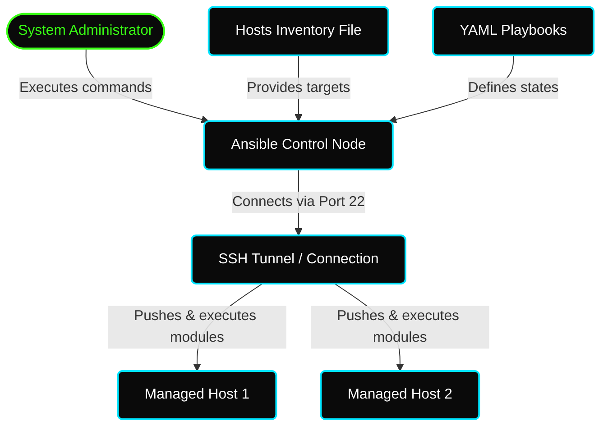

# ✦ Module: Introduction to Ansible

> **Infrastructure as Code (IaC).** Turn your system configurations into human-readable code. Learn why Ansible's agentless, push-based model makes it a leading configuration management and orchestration tool.

---

## ✦ What is Configuration Management?

In modern cloud environments, managing hundreds or thousands of virtual machines manually is impossible. Manual system administration is **time-consuming**, **error-prone**, and **repetitive**. 

**Configuration Management** is the methodology used to automate administrative tasks: installing software, configuring networking, establishing access controls, creating users, and scheduling backups. 

By treating configurations as code, your infrastructure becomes:
- **Testable** (runs through CI/CD pipelines)
- **Repeatable** (generates identical nodes on demand)
- **Versionable** (tracked in Git histories)

---

## ✦ Push-based vs. Pull-based Architecture

Configuration management tools generally fall into two categories:

| Parameter | Push-Based (e.g., Ansible) | Pull-Based (e.g., Chef, Puppet) |
|---|---|---|
| **Mechanism** | The central server (Control Node) pushes configurations to remote systems. | Remote agents on target systems periodically pull configuration files from the master. |
| **Agent Requirements** | **Agentless.** Requires no agent on target nodes (only standard SSH / python). | **Agent-based.** Requires installing and managing agent software on all host nodes. |
| **Simplicity** | Extremely simple; runs immediately without custom ports or firewalls. | Higher overhead to maintain agents, certificates, and daemon ports. |

---

## ✦ Ansible Architecture & Connection Flow

Ansible utilizes a **Control/Master Node** and **Managed/Slave Nodes**:
1.  **Control Node:** The system where Ansible is installed. Administrators write playbooks and execute commands from this host.
2.  **Managed Nodes:** The target servers (hosts) managed by Ansible. No Ansible software is installed here.
3.  **Modules:** Ansible executes tasks by compiling and pushing small programs called *modules* to the target machines via SSH. These modules run, achieve the desired state, and are immediately cleaned up.



---

## ✦ The Host Inventory File

The Inventory file (located by default at `/etc/ansible/hosts`) lists the target IP addresses, DNS domains, or hostnames of managed servers. You can organize nodes into logical groups:
*   **Ungrouped Hosts:** Listed at the beginning of the file, before any group headers.
*   **Grouped Hosts:** Categorized under brackets, e.g., `[webservers]` or `[dbservers]`. A host can belong to multiple groups.

---

## ✦ YAML Serialization Syntax

Ansible playbooks are written in **YAML** (Yet Another Markup Language), a human-friendly serialization language that relies on **indentation (spaces, not tabs)** and key-value pairings:
*   **Key-Value Pair:** `name: silver`
*   **Arrays/Lists:** Prefixed with a dash `-`
```yaml
skills:
  - linux
  - devops
  - ansible
```

---

## ✦ Playbooks & Roles Structure

### Playbook Components
A playbook contains one or more **plays** executed sequentially:
1.  **Host Section:** Identifies the target groups from the inventory.
2.  **Variable Section:** Declares local/vault-encrypted variables.
3.  **Task Section:** Ordered list of tasks representing actions to perform. Each task maps to a specific *module* (e.g., `apt`, `copy`, `service`).

### Playbook Target States
When specifying task goals, standard state parameters include:
*   `present`: Installs or creates the resource.
*   `absent`: Uninstalls or deletes the resource.
*   `latest`: Updates the resource to the newest version.
*   `restarted`: Restarts the service daemon.

### Ansible Roles (Modular Playbooks)
To manage complex infrastructure configurations (e.g., configuring a Kubernetes cluster), playbooks are split into **Roles** using a structured directory tree initialized by `ansible-galaxy`:
*   `tasks/`: Main tasks list.
*   `handlers/`: Service alerts and trigger rules.
*   `vars/` / `defaults/`: Variables configuration.
*   `templates/` / `files/`: Configuration templates and static files to copy.
*   `meta/`: Metadata (author, license).
