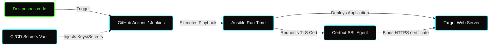

# ✦ Module: Ansible CI/CD & SSL Automation

> **Continuous Delivery and Security.** Bridge Ansible with modern pipelines (GitHub Actions, Jenkins) and automate Let's Encrypt SSL configurations.

---

## ✦ Why Integrate Ansible into CI/CD?

Ansible playbooks should not be executed manually from developer laptops in production environments. Instead, they are run within **CI/CD pipelines** (such as GitHub Actions or Jenkins) to achieve:
1. **Consistency:** Automated execution prevents humans from skipping crucial playbook parameters.
2. **Audit Trails:** Logs of every deployment are preserved inside the CI/CD job history.
3. **Secret Security:** Secrets (e.g., SSH Private Keys, DB passwords, API Tokens) are managed by the CI/CD provider and securely passed to Ansible at runtime.

---

## ✦ Let's Encrypt SSL Automation

Managing SSL/TLS certificates manually is error-prone and leads to downtime if a certificate expires. Ansible automates this lifecycle entirely:

1.  **Certbot Installation:** Installs `certbot` and server-specific plugins (like `python3-certbot-nginx`).
2.  **Certificate Procurement:** Runs `certbot` to verify domain ownership (via ACME challenge) and downloads the certificates.
3.  **Automatic Renewal:** Registers a cron job (using Ansible's `cron` module) to run `certbot renew` twice daily, securing the configuration permanently.
