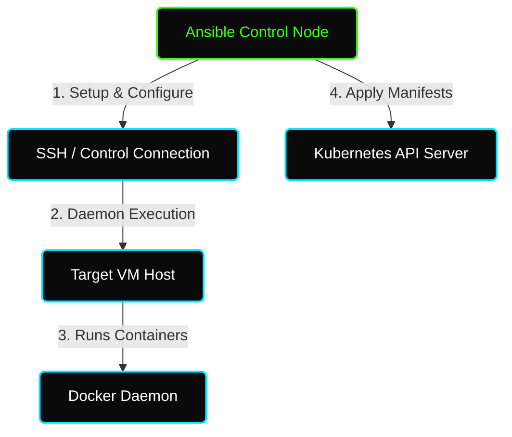

# ✦ Module: Ansible Container Automation

> **Orchestrating Containerized Infrastructures.** Learn how Ansible integrates with Docker and Kubernetes to provision, deploy, and manage multi-container applications at scale.

---

## ✦ Why Automate Containers with Ansible?

While Docker Compose and Kubernetes manifests define the *desired state* of your containers, Ansible acts as the orchestrator that:
1. **Bootstraps the Host:** Installs Docker, configures the daemon, updates security policies, and configures group privileges.
2. **Deploys Declaratively:** Applies Kubernetes manifests, injects dynamic vars/secrets from Ansible Vault, and manages ingress.
3. **Ensures Idempotency:** Verifies container state on remote hosts, preventing redundant rebuilds or container restarts.

---

## ✦ Docker Automation Fundamentals

Ansible provides the `community.general` and `community.docker` collections to interact with Docker. Instead of running raw Shell commands like `docker run`, Ansible provides structured YAML modules:

*   **`apt` / `yum`**: Used to bootstrap the system and install packages like `docker-ce` or `docker.io`.
*   **`service`**: Controls the daemon state (`started`, `enabled`).
*   **`user`**: Adds the remote user (e.g., `ansible`) to the `docker` group to enable passwordless container operations.
*   **`docker_container`**: Manages the life cycle of individual containers. Supports environment variables, ports, volume mapping, and restart policies.

---

## ✦ Kubernetes (K8s) Integration

For enterprise-scale orchestration, Ansible utilizes the `kubernetes.core` collection.

1.  **Requirement:** The target node must have the `kubernetes` Python library installed (`pip install kubernetes`).
2.  **`kubernetes.core.k8s`**: Deploys manifests directly using a local file path (`src: deployment.yml`) or via in-line definition.
3.  **`kubernetes.core.k8s_info`**: Retrieves real-time status and metadata about running Pods, Services, and Deployments.
