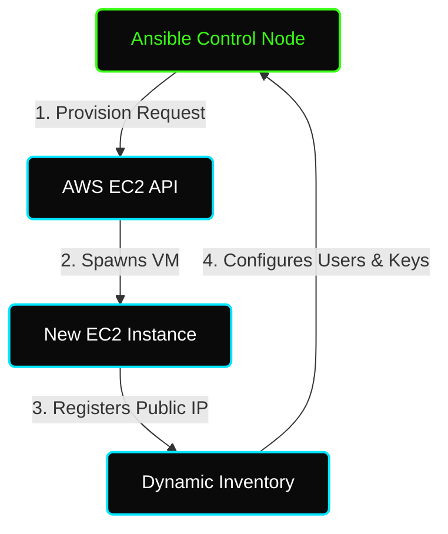

# ✦ Module: Ansible System Provisioning & User Management

> **Provisioning and Identity Management.** Provision AWS EC2 instances dynamically and configure enterprise user management and access policies at scale.

---

## ✦ Why Automate System Provisioning & Access?

In an enterprise environment, managing servers and user access manually is a security risk. Automating provisioning and access controls ensures:
1. **Zero-Trust Access:** SSH Keys are injected automatically, and access can be revoked by updating a central variables list and redeploying.
2. **Dynamic Configurations:** New instances can be provisioned in AWS and immediately configured by passing public IPs to an in-memory runtime inventory.
3. **Auditability:** User groups and permissions are version-controlled, allowing administrators to audit who has access to which environments.

---

## ✦ Dynamic Inventory and `add_host`

When provisioning resources on public clouds (like AWS EC2), the IP address of a newly created virtual machine is not known beforehand. 

Ansible solves this problem using the `add_host` module:
*   **Provisioning Stage:** The playbook runs locally against `localhost` and uses the `amazon.aws` collection to request new VMs from AWS.
*   **Registration Stage:** Once the VM is running, its public IP address is returned from the API, and `add_host` registers it into a temporary, in-memory host group (e.g., `new_servers`).
*   **Configuration Stage:** The playbook executes secondary plays directly targeting `new_servers` to install packages, configure users, and set up applications.

---

## ✦ Scalable User Management

Rather than writing individual tasks for each user, Ansible relies on variables and loops:
*   **Variable Dictionaries:** Defines a list of users, their target shells, supplementary groups (like `sudo` or `docker`), and their target state (`present` or `absent`).
*   **`loop` Module:** Evaluates the list sequentially, creating or deleting users in a single task.
*   **`authorized_key` Module:** Looks up public keys stored in a directory and registers them to authorized hosts, securing access without passwords.
