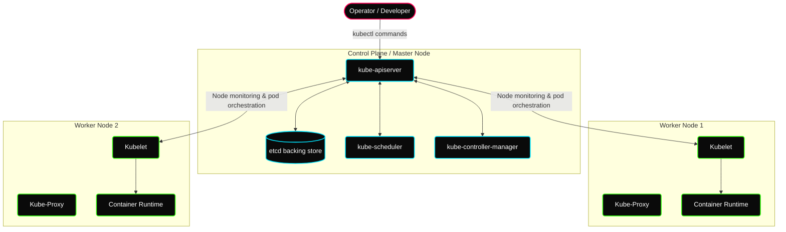

# ✦ Module: Kubernetes Architecture & Foundations

> **Container Orchestration at Scale.** Transition from managing single containers to coordinating massive, distributed clusters. Learn why Kubernetes is the industry-standard platform for automating container deployment, scaling, and operational lifecycle management.

---

## ✦ What is Kubernetes?

Managing isolated containers across multiple machines becomes increasingly complex at scale. **Kubernetes** (often abbreviated as **K8s**—representing the 8 letters between 'K' and 's') is an open-source container orchestration engine originally developed by Google and now maintained by the **Cloud Native Computing Foundation (CNCF)**.

Kubernetes abstracts the underlying physical or virtual infrastructure, providing a unified API to deploy, scale, and manage containerized workloads. It acts as an operating system for cluster computing, transforming a pool of virtual or bare-metal machines into a single elastic resource.

### ✦ Core Features of Kubernetes

*   **Service Discovery & Load Balancing:** Exposes containers to the network using DNS names or unique IP addresses, automatically balancing load across identical replicas.
*   **Horizontal & Vertical Autoscaling:** Automatically scales the number of running containers up or down based on CPU/memory usage, or custom metrics (HPA), and resizes container resource allocations dynamically (VPA).
*   **Self-Healing (Auto-Healing):** Automatically restarts failed containers, replaces and reschedules containers when nodes die, and destroys containers that fail user-defined health checks.
*   **Automated Rollouts & Rollbacks:** Declares the desired state for deployed containers, letting Kubernetes transition the actual state to the desired state gradually while monitoring health. Reruns previous configurations if errors occur.
*   **Storage Orchestration:** Automatically mounts local storage, cloud-provider block storage (like AWS EBS), or network filesystems (like NFS) to containers.
*   **Secret & Configuration Management:** Decouples configuration parameters and sensitive information (passwords, tokens, keys) from container images, letting you update them without rebuilding.

---

## ✦ History: From Borg to CNCF

Kubernetes has a rich history stemming from Google’s internal container cluster management systems:
1.  **Borg (2003–Present):** Google's first-generation large-scale cluster manager, running hundreds of thousands of jobs across thousands of machines.
2.  **Omega (2013–Present):** Borg’s successor, introducing a decentralized architecture and shared-state model to support massive scale.
3.  **Kubernetes (2014):** Google engineers combined the lessons learned from Borg and Omega to write a new container manager in **Go (Golang)**. It was released as open-source in 2014 and donated to the CNCF as its seeding project.

---

## ✦ High-Level Cluster Architecture

A Kubernetes cluster is divided into two primary logical planes:
1.  **The Control Plane (Master Node):** The "brain" of the cluster that makes global decisions (scheduling, event handling, maintaining state).
2.  **Worker Nodes:** The "worker bees" that run the actual container workloads and report health back to the control plane.

---

## ✦ Control Plane Components (Deep-Dive)

The Control Plane manages the cluster's state. It consists of four main processes:

### 1. `kube-apiserver` (The Gateway)
*   **Function:** Exposes the Kubernetes API. It is the front end of the control plane.
*   **Role:** All administrative operations (via `kubectl` CLI, dashboards, or internal components) communicate through the API server. It validates and configures data for objects such as Pods, Services, and Deployments.
*   **Key Fact:** Stateless; stores nothing itself. It can run multiple instances to balance load. Every `kubectl` command hits the API Server first.

### 2. `etcd` (The Backing Store)
*   **Function:** Consistent, highly-available, distributed key-value store.
*   **Role:** Serves as the single source of truth for the cluster, storing all configuration data and the real-time state of every Kubernetes object (Pods, Deployments, Services, ConfigMaps, Secrets, Nodes, Namespaces).
*   **Key Fact:** Losing ETCD = losing all cluster knowledge. It must be backed up regularly.

### 3. `kube-scheduler` (The Orchestrator)
*   **Function:** Watches for newly created Pods that have no node assigned, and selects a worker node for them to run on.
*   **Role:** Evaluates node resource capacity, hardware constraints, taints, tolerations, and affinity rules to make optimal placement decisions.

### 4. `kube-controller-manager` (The Enforcer)
*   **Function:** Runs controller processes in the background to regulate the state of the cluster.
*   **Role:** Constantly compares the actual cluster state with the desired state (reconciliation loop). It contains:
    *   **Node Controller:** Monitors worker nodes, detecting when they stop responding.
    *   **ReplicaSet Controller:** Spawns/recreates Pods to maintain the desired count if a Pod dies.
    *   **Route Controller:** Configures networking routes in the infrastructure.
    *   **Volume Controller:** Manages mounting/detaching storage volumes.

---

## ✦ Worker Node & Node-Level Components

Worker Nodes host the containers that form the application workloads. Each node runs critical services:

### 1. `kubelet` (The Node Agent)
*   **Function:** An agent that runs on every worker node in the cluster.
*   **Role:** Ensures that containers are running in a Pod according to the PodSpecs (Pod Specifications) sent by the API Server. It monitors container health and reports success/failure metrics back to the Control Plane.

### 2. Container Runtime (CRI)
*   **Function:** The engine responsible for running containers.
*   **Role:** Pulls container images from registries, allocates resources, and manages container startup, execution, and termination.
*   **Examples:** `containerd`, `CRI-O`, Docker Engine.

### 3. `kube-proxy` (The Network Router)
*   **Function:** A network proxy that runs on each node in the cluster.
*   **Role:** Maintains network rules on nodes (iptables/IPVS) to route traffic destined for a Service to the correct backend Pods, enabling load balancing.

### 4. `KindNet` (CNI Plugin)
*   **Function:** Container Network Interface (CNI) provider.
*   **Role:** Handles Pod-to-Pod network communication across the cluster virtual network.

### 5. `CoreDNS` (DNS Server)
*   **Function:** DNS server inside the cluster.
*   **Role:** Automatically registers and resolves service names to their respective virtual cluster IP addresses.
