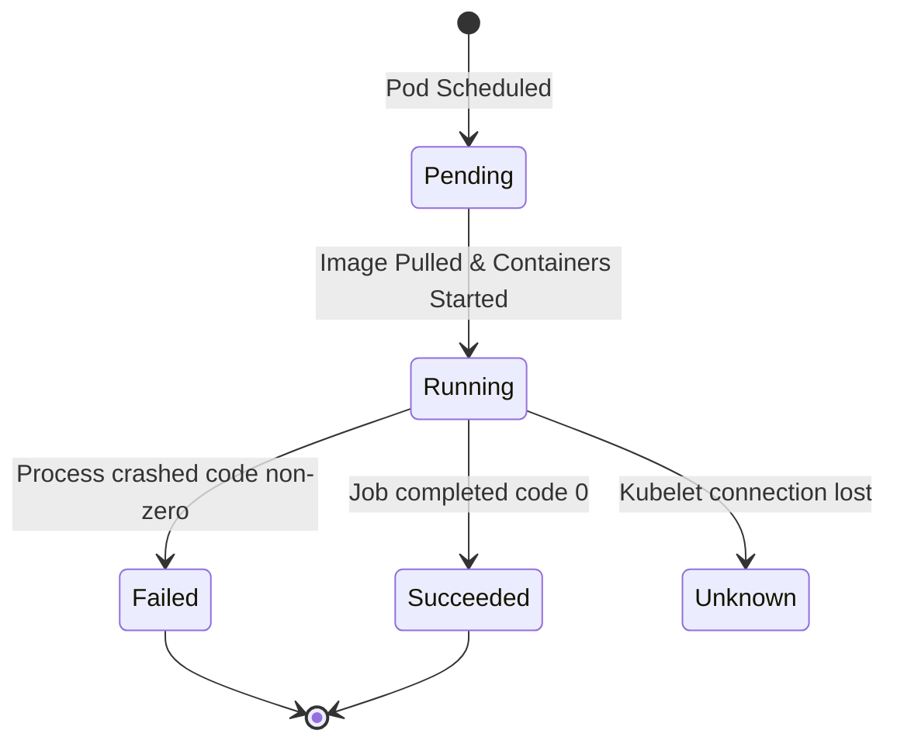

# ✦ Module: Pods, ReplicaSets & Deployments

> **Workload Orchestration.** Learn how to define and manage application workloads. Understand Pods as the fundamental compute unit, ReplicaSets for durability, and Deployments for automated, zero-downtime application updates and rollbacks.

---

## ✦ 1. Understanding Pods

A **Pod** is the smallest deployable compute unit in Kubernetes. It represents a single instance of a running process in your cluster.

Instead of running containers directly on worker nodes, Kubernetes wraps them inside a Pod. A Pod can contain one or more containers that share storage, network namespace, and specifications on how to run.

### Key Characteristics of Pods
*   **Shared Network:** All containers in a Pod share the same network namespace, IP address, and port range. They can communicate with each other over `localhost` (e.g., Node.js app communicating with local Redis database on localhost:6379).
*   **Shared Storage:** You can define shared volumes inside a Pod. Any container in the Pod can mount these volumes to access the same files.
*   **Ephemeral/Mortal:** Pods are not self-healing. If a Pod is scheduled on a node that crashes, the Pod is deleted. To guarantee high availability, Pods must be managed by higher-level controllers (like Deployments).
*   **Single-Container vs. Multi-Container Pods:** The standard pattern is "one container per Pod." However, multi-container Pods are used when two processes are tightly coupled.

### Multi-Container Design Patterns
1.  **Sidecar Pattern:** A helper container that enhances the main container (e.g., a filebeat container pulling logs from a shared volume and shipping them to Elasticsearch).
2.  **Ambassador Pattern:** A container acting as a proxy for connection to external systems (e.g., mapping localhost database connections to an external cloud database cluster).
3.  **Adapter Pattern:** A container that standardizes heterogeneous logs or monitoring metrics before exposing them to the cluster.

---

## ✦ 2. Anatomy of a Pod Manifest

Kubernetes objects are declared using declarative YAML files. Every manifest contains 4 essential blocks:

*   **`apiVersion`:** Specifies the version of the Kubernetes API schema used (e.g., `v1` for Pods/Services, `apps/v1` for Deployments/ReplicaSets).
*   **`kind`:** The type of object you want to create (e.g., `Pod`, `Service`, `Deployment`).
*   **`metadata`:** Identifies the object, including its name, namespace, labels, and annotations.
*   **`spec`:** The desired state for the object, detailing resource requirements, container images, volume mounts, and network ports.

### Pod YAML Example (`apache-pod.yaml`)
```yaml
apiVersion: v1
kind: Pod
metadata:
  name: apache-pod
  labels:
    app: web
    env: dev
spec:
  containers:
    - name: apache-container
      image: httpd:2.4
      ports:
        - containerPort: 80
```

---

## ✦ 3. The Pod Lifecycle

Kubernetes tracks the status of Pods through distinct lifecycle phases:



*   **Pending:** The Pod has been accepted by the cluster, but one or more containers are not yet running. This includes time spent waiting to be scheduled, pulling images over the network, or waiting for volumes to mount.
*   **Running:** The Pod has been bound to a node, and all containers have been created. At least one container is currently running, or is in the process of starting or restarting.
*   **Succeeded:** All containers in the Pod have terminated successfully (exited with code `0`) and will not be restarted (typical for Jobs).
*   **Failed:** All containers in the Pod have terminated, and at least one container has terminated in failure (exited with a non-zero code).
*   **Unknown:** The state of the Pod cannot be determined, usually due to a network communication failure between the control plane and the node's Kubelet.

---

## ✦ 4. ReplicaSets: The Durability Layer

A **ReplicaSet** is a controller that ensures a specified number of identical Pod replicas are running at any given time.
*   **Role:** If a Pod crashes or its host node fails, the ReplicaSet immediately spawns a replacement Pod on an active node, maintaining the desired scale.
*   **Next-Gen Controller:** ReplicaSets are the successor to *Replication Controllers (RC)*. The key difference is that ReplicaSets support **set-based selectors** (e.g., matching labels like `env in (dev, staging)`), whereas Replication Controllers only supported equality-based selectors (e.g., `env=dev`).
*   *Note:* You should rarely deploy ReplicaSets directly. Instead, deploy a **Deployment**, which manages ReplicaSets automatically in the background.

---

## ✦ 5. Deployments: Declarative Application Lifecycle

A **Deployment** is a high-level controller that manages the release, scaling, and rolling update of Pods. Under the hood, a Deployment creates and updates ReplicaSets.

```mermaid
flowchart TD
    classDef depl fill:#0A0A0A,stroke:#FF0055,stroke-width:2px,color:#FFFFFF,rx:5px,ry:5px;
    classDef rs fill:#0A0A0A,stroke:#00E5FF,stroke-width:2px,color:#FFFFFF,rx:5px,ry:5px;
    classDef pod fill:#0A0A0A,stroke:#39FF14,stroke-width:2px,color:#FFFFFF,rx:5px,ry:5px;

    Deploy[Deployment: frontend]:::depl
    RS_Active[ReplicaSet: frontend-abcde]:::rs
    RS_Old[ReplicaSet: frontend-12345]:::rs
    
    Pod1[Pod: frontend-abcde-1]:::pod
    Pod2[Pod: frontend-abcde-2]:::pod
    PodOld[Pod: frontend-12345-1 (Terminating)]:::pod

    Deploy -->|Manages active release| RS_Active
    Deploy -->|Maintains history / scales down| RS_Old
    RS_Active --> Pod1
    RS_Active --> Pod2
    RS_Old --> PodOld
```

### Rollout Strategies

1.  **Recreate Strategy:** Terminates all existing Pods before creating new ones. This causes application downtime but prevents two different versions of the code from running concurrently.
2.  **RollingUpdate Strategy (Default):** Gradually replaces old Pods with new ones, ensuring zero-downtime. You control this process using two key parameters:
    *   `maxSurge`: The maximum number of Pods that can be created above the desired capacity during the update (e.g., `25%` or `1`).
    *   `maxUnavailable`: The maximum number of Pods that can be unavailable during the update process (e.g., `25%` or `0`).
    *   *Tip:* Setting `maxUnavailable: 0` ensures that no existing instances are removed until new instances are running and ready to handle traffic.

### Deployment YAML Example (`nginx-deployment.yaml`)
```yaml
apiVersion: apps/v1
kind: Deployment
metadata:
  name: nginx-deployment
  labels:
    app: web
spec:
  replicas: 3
  strategy:
    type: RollingUpdate
    rollingUpdate:
      maxSurge: 1
      maxUnavailable: 0
  selector:
    matchLabels:
      app: web
  template:
    metadata:
      labels:
        app: web
    spec:
      containers:
        - name: nginx
          image: nginx:1.21.6
          ports:
            - containerPort: 80
```
