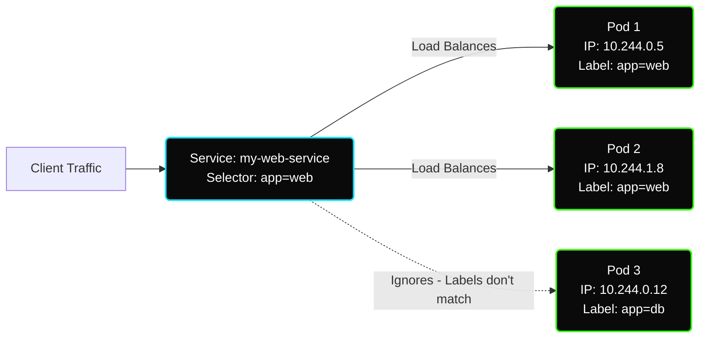
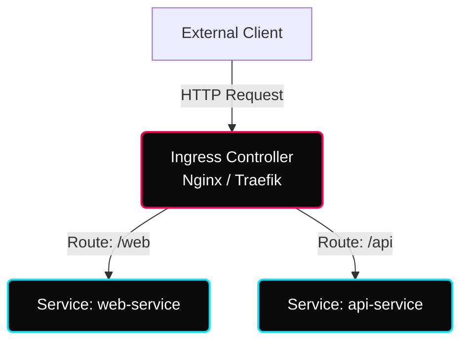

# ✦ Module: Kubernetes Services & Networking

> **Cluster Connectivity & Ingress.** Learn how Kubernetes exposes workloads securely. Understand the four-tier networking model, the role of labels and selectors in routing traffic, Service Types (ClusterIP, NodePort, LoadBalancer), and HTTP/HTTPS Ingress routing.

---

## ✦ 1. The Kubernetes Networking Model

In standard virtualization, mapping network ports from host machines to containers is a major operational headache. Kubernetes solves this by enforcing an **IP-per-Pod** networking model.

### Key Rules of Kubernetes Networking
1.  **Direct Pod-to-Pod Communication:** Every Pod in a cluster receives a unique IP address. Pods can communicate with all other Pods on any node directly, without NAT (Network Address Translation).
2.  **Container-to-Container Communication:** Containers inside the same Pod share the network namespace and IP. They communicate via the `localhost` loopback interface.
3.  **No Port Mapping:** Containers do not need to bind to the host's ports; they bind directly to the Pod's ports, avoiding port conflicts.

---

## ✦ 2. The Service Object: Abstracting Pod IPs

Pods in Kubernetes are ephemeral. Their IP addresses change whenever they are restarted, scaled out, or rescheduled due to node failure. 

A **Service** is a Kubernetes abstraction that defines a logical set of Pods and a policy to access them. A Service provides a stable, persistent **Virtual IP (VIP)** and DNS name. It load-balances traffic across all healthy matching Pods using a round-robin algorithm.

### How Services Find Pods: Labels & Selectors
Services use **Labels and Selectors** to determine which Pods should receive their traffic. 
-   The Service controller continuously monitors the cluster. When a Pod with matching labels (e.g. `app: web`) is created or destroyed, its IP address is automatically added to or removed from the Service's **Endpoints** list.



---

## ✦ 3. Core Service Types

When defining a Service, you specify its `type` in the manifest file. There are 4 core types:

| Service Type | Reachability | Default Port Range | Primary Use Case |
|---|---|---|---|
| **ClusterIP** (Default) | Internal to Cluster only | Dynamic | Exposing database backends or internal APIs to other microservices. |
| **NodePort** | External via Node IPs | `30000 – 32767` | Directly exposing services on a static port on each worker node. |
| **LoadBalancer** | External via Cloud LB | Cloud specific | Exposing services publicly in cloud providers (AWS, GCP, Azure). |
| **ExternalName** | Maps to DNS name | N/A | Integrating external services (e.g., RDS instance) into cluster DNS. |

### Special: Headless Services
A **Headless Service** is configured by setting `clusterIP: None` in the spec. Instead of returning a single Virtual IP, a DNS lookup on a headless service returns the direct IP addresses of all backing Pods. This is crucial for stateful systems (like database clusters) that require peer-to-peer communication rather than load balancing.

---

## ✦ 4. Service Manifest Example

Here is a manifest definition for a **NodePort** service exposing an Apache deployment:

```yaml
apiVersion: v1
kind: Service
metadata:
  name: apache-service
spec:
  type: NodePort
  selector:
    app: web
  ports:
    - protocol: TCP
      port: 80         # Port exposed on the Service's Virtual IP
      targetPort: 80   # Port on the target Pods container
      nodePort: 30080  # Port exposed on every worker node (30000-32767)
```

---

## ✦ 5. Ingress & Ingress Controllers

While a `LoadBalancer` service creates one external load balancer per Service, **Ingress** acts as a single gateway that routes external HTTP/HTTPS traffic to multiple internal Services based on paths or hostnames.

### Ingress Architecture
1.  **Ingress Resource:** A YAML manifest containing a collection of routing rules (e.g. `/api` routes to service A, `/static` routes to service B).
2.  **Ingress Controller:** The actual reverse proxy/load balancer running inside the cluster (e.g., Nginx Ingress Controller, Traefik, HAProxy) that reads Ingress rules and routes traffic accordingly.



### Ingress YAML Example (`ingress-rules.yaml`)
```yaml
apiVersion: networking.k8s.io/v1
kind: Ingress
metadata:
  name: main-ingress
  annotations:
    nginx.ingress.kubernetes.io/rewrite-target: /
spec:
  ingressClassName: nginx
  rules:
    - host: app.example.com
      http:
        paths:
          - path: /web
            pathType: Prefix
            backend:
              service:
                name: web-service
                port:
                  number: 80
          - path: /api
            pathType: Prefix
            backend:
              service:
                name: api-service
                port:
                  number: 8080
```
