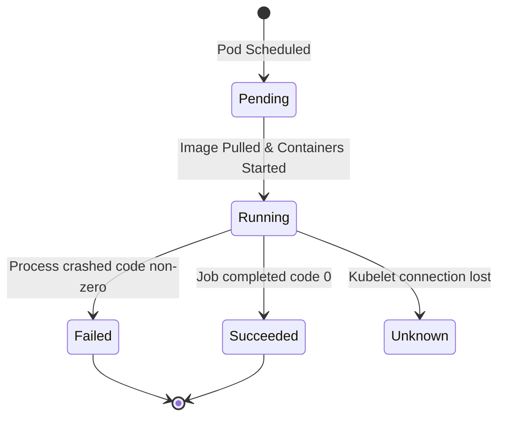
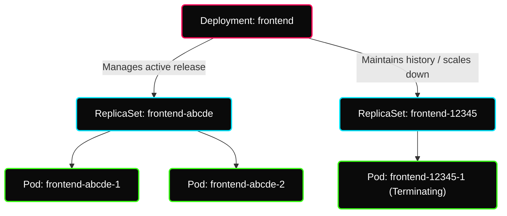

# ✦ Module: Pods, ReplicaSets & Deployments

> **Workload Orchestration.** Learn how to define and manage application workloads. Understand Pods as the fundamental compute unit, ReplicaSets for durability, and Deployments for automated, zero-downtime application updates and rollbacks.

---

## ✦ 1. Understanding Pods & Pod Internals

A **Pod** is the smallest deployable compute unit in Kubernetes. It represents a single instance of a running process in your cluster.

Instead of running containers directly on worker nodes, Kubernetes wraps them inside a Pod. A Pod can contain one or more containers that share storage, network namespace, and specifications on how to run.

```
 ■■■■■■■■■■■■■■■■■■■■■■■■■■■■■■■■■■■
 ■               Pod               ■
 ■   IP: 10.244.0.5                ■
 ■                                 ■
 ■   ┌──────────────┐┌─────────┐   ■
 ■   │  Container1  ││Container│   ■
 ■   │   (nginx)    ││(sidecar)│   ■
 ■   └──────────────┘└─────────┘   ■
 ■   Shared IP  ·  Shared Volumes  ■
 ■■■■■■■■■■■■■■■■■■■■■■■■■■■■■■■■■■■
```

### Key Characteristics of Pods
*   **Shared Network:** All containers in a Pod share the same network namespace, IP address, and port range. They can communicate with each other over `localhost` (e.g., Node.js app communicating with local Redis database on `localhost:6379`).
*   **Shared Storage:** You can define shared volumes inside a Pod. Any container in the Pod can mount these volumes to access the same files.
*   **Ephemeral/Mortal:** Pods are not self-healing. If a Pod is scheduled on a node that crashes, the Pod is deleted. To guarantee high availability, Pods must be managed by higher-level controllers (like Deployments).

### Multi-Container Design Patterns
1.  **Sidecar Pattern:** A helper container that enhances the main container (e.g., an nginx web server serving application logs, and a logging sidecar agent forwarding them to Elasticsearch).
2.  **Ambassador Pattern:** A container acting as a proxy for connection to external systems (e.g., mapping localhost database connections to an external cloud database cluster).
3.  **Adapter Pattern:** A container that standardizes heterogeneous logs or monitoring metrics before exposing them to the cluster.

---

## ✦ 2. The Pod Lifecycle & Events

Kubernetes tracks the status of Pods through distinct lifecycle phases and sequence events:



### Pod Lifecycle Events (Step-by-Step)
1.  **Scheduled:** The Scheduler picks a Node for the Pod based on resource allocations.
2.  **Pulling:** The target Node begins downloading the container image from the registry.
3.  **Pulled:** The container image download completes successfully.
4.  **Created:** The container is created inside the Pod namespace.
5.  **Started:** The container runtime starts the process, and the container is now running.

---

## ✦ 3. Why Standalone Pods Are Bad in Production

> [!WARNING]
> **Standalone Pods have NO controller watching them.**
> If a standalone Pod crashes, or if the underlying worker node fails, Kubernetes will **NOT** recreate or reschedule it.
> Production workloads should **always** be managed by a **Deployment** (which manages a ReplicaSet) to ensure Pods are self-healing.

---

## ✦ 4. ReplicaSets: The Durability Layer

A **ReplicaSet** is a controller that ensures a specified number of identical Pod replicas are running at any given time.
*   **Role:** If a Pod crashes or its host node fails, the ReplicaSet immediately spawns a replacement Pod on an active node, maintaining the desired scale.
*   **Set-Based Selectors:** ReplicaSets support **set-based selectors** (e.g., matching labels like `env in (dev, staging)`), whereas legacy Replication Controllers only supported equality-based selectors (e.g., `env=dev`).
*   *Note:* You should rarely deploy ReplicaSets directly. Instead, deploy a **Deployment**, which manages ReplicaSets automatically in the background.

---

## ✦ 5. Deployments: Declarative Application Lifecycle

A **Deployment** is a high-level controller that manages the release, scaling, and rolling update of Pods. Under the hood, a Deployment creates and updates ReplicaSets.



### Deployment vs ReplicaSet – Responsibilities

| Feature / Responsibility | Deployment | ReplicaSet |
|---|---|---|
| **Pod Count Maintenance** | Delegates to ReplicaSet | **Maintains desired Pod count** |
| **Self-Healing** | Delegates to ReplicaSet | **Recreates crashed Pods** |
| **Scaling** | Scales the ReplicaSet | **Scales Pods up and down** |
| **Version Management** | **Manages versions & rolling updates** | Owned by the Deployment |
| **Rolling Updates** | **Executes zero-downtime rollouts** | Owned by the Deployment |
| **Rollbacks** | **Undoes rollouts to previous version** | Owned by the Deployment |

> [!TIP]
> **Key Insight:**
> The Deployment creates the ReplicaSet. The ReplicaSet creates the Pods. When a Pod crashes, the **ReplicaSet** (not the Deployment) is responsible for creating the replacement. This is a common interview trick question!

### Rollout Strategies
1.  **Recreate Strategy:** Terminates all existing Pods before creating new ones. This causes application downtime but prevents two different versions of the code from running concurrently.
2.  **RollingUpdate Strategy (Default):** Gradually replaces old Pods with new ones, ensuring zero-downtime. You control this process using two key parameters:
    *   `maxSurge`: The maximum number of Pods that can be created above the desired capacity during the update (e.g., `25%` or `1`).
    *   `maxUnavailable`: The maximum number of Pods that can be unavailable during the update process (e.g., `25%` or `0`).
    *   *Tip:* Setting `maxUnavailable: 0` ensures that no existing instances are removed until new instances are running and ready to handle traffic.
