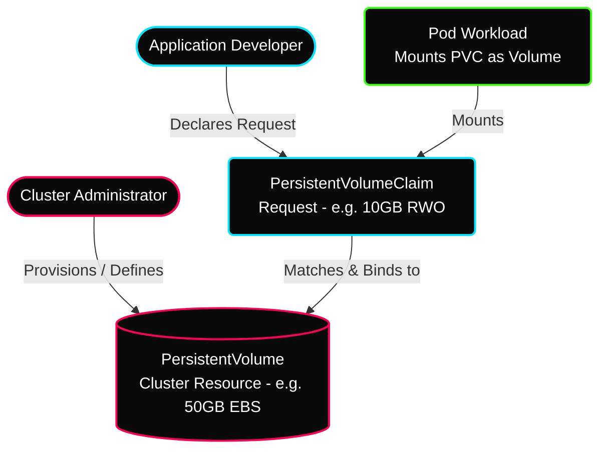
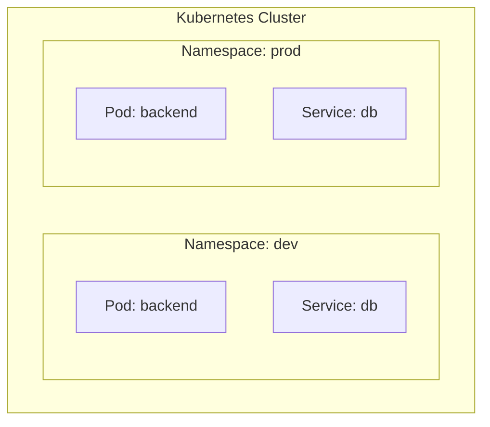

# ✦ Module: Kubernetes Storage & Configuration

> **Decoupling Data and Configuration.** Understand how Kubernetes manages state and parameters. Master volumes (emptyDir, hostPath), the Persistent Volume (PV) and Claim (PVC) subsystem, ConfigMaps, Secrets, and logical cluster partitioning using Namespaces.

---

## ✦ 1. Container Storage & Ephemeral Volumes

By default, container filesystems are ephemeral. If a container crashes, the container agent (Kubelet) restarts it, but all data written to the container's disk is lost. 

To solve this, Kubernetes uses **Volumes**. A Volume is a storage directory associated with a Pod:
*   It is defined at the Pod level and can be mounted into any container in that Pod.
*   It outlives individual container restarts; however, standard volumes are deleted when the Pod itself is terminated.

### Basic Volume Types
1.  **emptyDir:** A temporary directory created when a Pod is assigned to a node. It exists as long as the Pod is running.
    *   *Use Case:* Sharing temporary cache directories between a frontend and backend container in the same Pod.
2.  **hostPath:** Mounts a file or directory from the host node’s physical filesystem directly into the Pod.
    *   *Use Case:* Running system daemons (like log collectors) that need direct access to host logs at `/var/log`.

---

## ✦ 2. Persistent Volumes (PV) & Claims (PVC)

For databases and stateful applications, data must survive Pod termination. Kubernetes separates storage provisioning from consumption using a two-tier model:



1.  **PersistentVolume (PV):** A piece of storage in the cluster provisioned by an administrator or dynamically provisioned using Storage Classes. It is a cluster-wide resource (like a Node) and exists independently of any Pod.
2.  **PersistentVolumeClaim (PVC):** A request for storage by a developer. It specifies size (e.g. 10Gi), access modes, and storage classes. Kubernetes automatically binds matching PVCs to available PVs.

### Storage Access Modes
*   **ReadWriteOnce (RWO):** The volume can be mounted as read-write by a single node.
*   **ReadOnlyMany (ROX):** The volume can be mounted as read-only by many nodes.
*   **ReadWriteMany (RWX):** The volume can be mounted as read-write by many nodes (requires network storage like NFS or AWS EFS).

---

## ✦ 3. PV & PVC Manifest Example

### PersistentVolume (`pv-ebs.yaml`)
```yaml
apiVersion: v1
kind: PersistentVolume
metadata:
  name: ebs-pv
spec:
  capacity:
    storage: 10Gi
  accessModes:
    - ReadWriteOnce
  persistentVolumeReclaimPolicy: Retain
  hostPath:
    path: "/mnt/data"  # local testing fallback (production uses AWS EBS / EFS / CSI drivers)
```

### PersistentVolumeClaim (`pvc-claim.yaml`)
```yaml
apiVersion: v1
kind: PersistentVolumeClaim
metadata:
  name: ebs-pvc
spec:
  accessModes:
    - ReadWriteOnce
  resources:
    requests:
      storage: 5Gi
```

---

## ✦ 4. Decoupling Configuration: ConfigMaps & Secrets

Applications require configuration settings (ports, URLs) and credentials (passwords, API keys). Decoupling these parameters from container images ensures portability.

### ConfigMaps
Stores non-sensitive configuration parameters as key-value pairs. They can be injected into containers as environment variables, command-line arguments, or mounted as files.

### Secrets
Similar to ConfigMaps, but designed for sensitive data (API keys, certificates, DB passwords).
*   **Storage Location:** Secrets data is stored on worker nodes in **`tmpfs`** (a virtual filesystem that keeps all files in RAM), ensuring they never touch physical disks.
*   **Security Limit:** Maximum size limit of **1 MB** per secret object.
*   *Warning:* Kubernetes secrets are only **Base64-encoded** by default, not encrypted. In production, clusters must use KMS (Key Management Service) encryption-at-rest for the etcd database, or fetch secrets dynamically from vaults (e.g. AWS Secrets Manager).

### ConfigMap & Secret Manifest Examples
```yaml
# ConfigMap Definition
apiVersion: v1
kind: ConfigMap
metadata:
  name: app-config
data:
  database_url: "jdbc:mysql://db-service:3306/db"
  max_connections: "200"
---
# Secret Definition
apiVersion: v1
kind: Secret
metadata:
  name: db-secret
type: Opaque
data:
  # Values must be Base64-encoded
  # echo -n "admin" | base64 -> YWRtaW4=
  db_user: YWRtaW4=
  # echo -n "Pass123" | base64 -> UGFzczEyMw==
  db_password: UGFzczEyMw==
```

---

## ✦ 5. Partitioning the Cluster: Namespaces

A **Namespace** is a logical partitioning mechanism within a single Kubernetes cluster. It provides a scope for names and isolates resources.



### Namespaced vs. Cluster-Wide Resources
*   **Namespaced Resources:** Exist only inside a specific namespace (e.g., Pods, Services, Deployments, ConfigMaps, Secrets, PVCs). You can have a Pod named `backend` in the `dev` namespace and another Pod named `backend` in the `prod` namespace.
*   **Cluster-Wide Resources:** Are global to the cluster and cannot be scoped inside namespaces (e.g., Nodes, Namespaces, PersistentVolumes).
