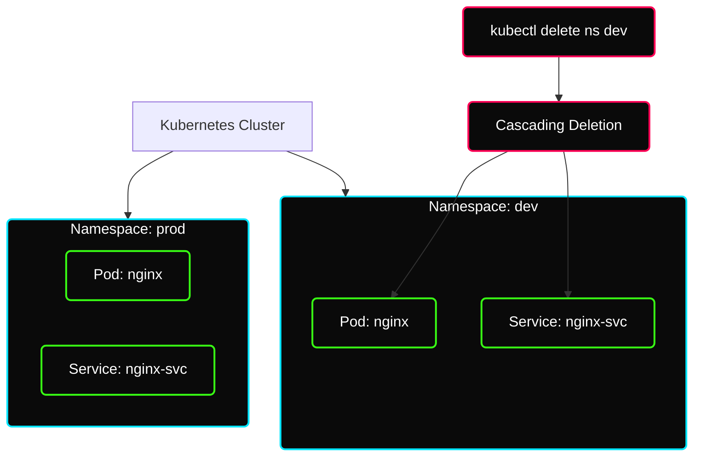
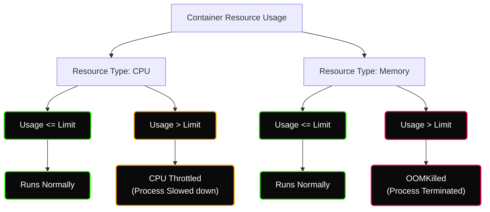
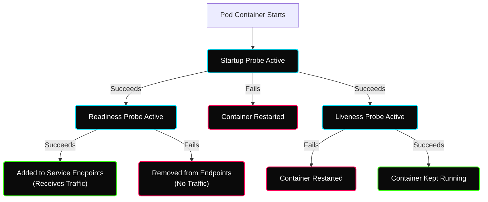

# ✦ Module: Kubernetes Namespaces & Resource Management

> **Namespaces, Resource Management & Health Probes.** Learn how to organize cluster resources, control CPU and memory allocations, and configure liveness, readiness, and startup probes to guarantee application availability.

---

## ✦ 1. Understanding Kubernetes Namespaces

### The Problem: Single Flat Space
In an enterprise environment, a single Kubernetes cluster is typically shared across multiple teams, projects, and environments (development, QA, staging, production). If all workloads are deployed into a single flat space (like the `default` namespace), management becomes impossible:
*   **Name Conflicts:** Two teams cannot deploy a service named `api-service` simultaneously.
*   **Cluttered Command Outputs:** Running `kubectl get pods` displays hundreds of unrelated pods, making debugging a nightmare.
*   **Lack of Access Control:** A developer debugging a dev service could accidentally delete a production database pod.
*   **No Resource Isolation:** A rogue development pod could consume all CPU/memory on a node, starving production workloads.

### The Solution: Logical Partitioning
Namespaces act as **virtual clusters** or folders inside a single physical Kubernetes cluster. They provide a scope for names, allowing resources of the same type to have identical names as long as they reside in different namespaces.



### Namespace Characteristics & Lifecycle
*   **Name Uniqueness:** Names must be unique within a namespace, but not across namespaces.
*   **Cascading Deletion:** Deleting a namespace triggers a cascading deletion. Kubernetes recursively terminates and deletes every single resource (Pods, Deployments, Services, ConfigMaps, Secrets, PVCs) scoped inside that namespace.
*   **Non-Namespaced Resources:** Not all Kubernetes resources are namespace-scoped. Low-level cluster resources (such as `Nodes`, `PersistentVolumes`, `StorageClasses`) and metadata-related resources (such as `Namespaces` themselves) are cluster-scoped.

### Default Namespaces
Every cluster is bootstrapped with four default namespaces:

| Namespace | Description & Purpose |
|---|---|
| `default` | The fallback namespace for any object created without an explicit namespace setting. |
| `kube-system` | The namespace for core system components created by the Kubernetes control plane (e.g., `coredns`, `kube-proxy`, `etcd`, `kube-apiserver`). |
| `kube-public` | Automatically created and readable by all users (even unauthenticated). Used primarily for bootstrap cluster configurations. |
| `kube-node-lease` | Holds Lease objects associated with each node. These leases allow the kubelet to send heartbeats so the control plane can detect node failures efficiently. |

---

## ✦ 2. Resource Requests and Limits

To prevent resource contention and ensure cluster stability, Kubernetes allows you to specify the resource requirements for each container in a Pod.

```yaml
resources:
  requests:
    cpu: 250m
    memory: 128Mi
  limits:
    cpu: 500m
    memory: 256Mi
```

### Requests vs. Limits

*   **Requests (Reservation):** The minimum amount of resources (CPU and Memory) that a container is guaranteed to get. The Kubernetes **Scheduler** uses requests to decide which node is capable of hosting the Pod. It calculates the sum of requests of all containers already running on a node; if adding the new Pod's requests exceeds the node's allocatable capacity, the Pod will not be scheduled there.
*   **Limits (Ceiling):** The absolute maximum amount of resources a container is allowed to consume at runtime. These limits are enforced by the local **Kubelet** using Linux kernel `cgroups` (control groups).

### Compression (CPU) vs. Starvation (Memory)

CPU and Memory behave fundamentally differently when a container attempts to exceed its allocated resources:



#### CPU (Compressible Resource)
*   **Throttling:** CPU is a shareable, time-sliced resource. If a container requests more CPU than its limit, the host kernel throttles the container's access to CPU cycles.
*   **Behavior:** The application does not crash. It simply runs slower, processing requests at a reduced rate.

#### Memory (Incompressible Resource)
*   **OOM-Killing:** Memory cannot be compressed or time-sliced. If an application runs out of memory, it cannot continue processing.
*   **Behavior:** If a container exceeds its memory limit, the Linux kernel Out-Of-Memory (OOM) killer intervenes and terminates the container process. The Pod's container status will show `OOMKilled` (Exit Code 137).

---

## ✦ 3. Health Probes (Liveness, Readiness, and Startup)

Kubernetes processes might report a container as `Running` even if the application inside is deadlocked, hung, or failing to connect to its backend database. Health probes allow the Kubelet to actively monitor the health of your containers.



### The Three Probe Types

1.  **Startup Probe:**
    *   **Purpose:** Determines if the application inside the container has successfully started up.
    *   **Behavior:** All other probes (Liveness and Readiness) are disabled until the startup probe succeeds. This prevents slow-starting legacy applications from being killed by the liveness probe before they are fully up.
    *   **Failure Action:** If the startup probe fails, the Kubelet kills the container, and the Pod's restart policy is applied.

2.  **Liveness Probe:**
    *   **Purpose:** Determines if the container needs to be restarted. It detects deadlocks or broken states where the app is running but cannot make progress.
    *   **Behavior:** Runs periodically throughout the container's lifecycle.
    *   **Failure Action:** If the liveness probe fails, the Kubelet kills the container, and it restarts automatically.

3.  **Readiness Probe:**
    *   **Purpose:** Determines if a container is ready to accept client traffic.
    *   **Behavior:** Runs periodically. If an application is doing heavy computations, warming up caches, or waiting for a database to migrate, it should report ready as `false`.
    *   **Failure Action:** If the readiness probe fails, Kubernetes removes the Pod's IP address from the Endpoints list of all matching Services. No traffic is routed to the Pod until it reports ready again. **Unlike liveness probes, readiness failures do not cause container restarts.**

### Probe Action Mechanisms
Probes can execute one of four checks:
*   `httpGet`: Performs an HTTP GET request against the container's IP on a specified port and path. Succeeds if the response status is $\ge 200$ and $< 400$.
*   `exec`: Executes a specified command inside the container. Succeeds if the command exits with status code 0.
*   `tcpSocket`: Performs a TCP check against the container's IP on a specified port. Succeeds if the port is open.
*   `grpc`: Performs a gRPC health check. Succeeds if the status of the response is `SERVING`.

---

## ✦ 4. The Apartment & Water Tank Analogy (Mental Models)

To keep these concepts clear in an interview, use these mental models:

> [!NOTE]
> **Namespace Analogy: Folders on a Computer**
> Imagine a shared company drive. Instead of putting everyone's files in the root folder (chaos), you create folders named `/dev`, `/qa`, and `/prod`. Developers can create `/dev/report.docx` without affecting `/prod/report.docx`. Deleting a folder deletes everything inside it.

> [!TIP]
> **Resource Requests vs. Limits Analogy: The Rental Apartment**
> *   **Request:** "I am signing a lease. I need a guarantee of at least 1 bedroom for my family." (The scheduler will only place you in a building with at least 1 free bedroom).
> *   **Limit:** "The landlord says the building safety rules limit occupancy to 4 people max." If a 5th person tries to move in, they are immediately evicted (OOMKilled). If you turn up the music too loud (CPU usage), the landlord forces you to turn it down (Throttling), but does not kick you out.

---

## ✦ 5. Key Interview Q&A

**Q1: What is the blast radius if a developer runs `kubectl delete pods --all` without specifying a namespace?**
> The command only targets Pods in the *current active namespace* of the context (default is `default` unless changed). It will not affect Pods in other namespaces like `production` or `kube-system`. This makes namespaces a crucial blast-radius boundary.

**Q2: Why does the Kubernetes Scheduler look at resource `requests` instead of live node resource usage when placing Pods?**
> Live resource usage fluctuates constantly. If the scheduler placed Pods based on current usage, a quiet cluster could become overcommitted. When traffic spikes, all Pods would scale their consumption simultaneously, causing the nodes to run out of resources and crash. Using `requests` ensures a predictable reservation model.

**Q3: If a Pod is stuck in the `Pending` state, what is the most common resource-related cause?**
> Insufficient cluster capacity. The scheduler compares the Pod's resource `requests` against the allocatable capacity of all worker nodes. If no node has enough uncommitted resources to satisfy the requests, the Pod remains `Pending`. This can be verified by running `kubectl describe pod <pod-name>` and looking at the Events section.

**Q4: A Pod has a liveness probe pointing to `/healthz` and a readiness probe pointing to `/ready`. If the database connection drops, which probe should fail and why?**
> Only the **readiness probe** should fail. Failing the readiness probe removes the Pod from Service endpoints, preventing clients from getting 500 errors while the app is unhealthy. If the liveness probe failed, Kubernetes would restart the container; since restarting does not fix a dead database, it would cause a useless restart loop.
